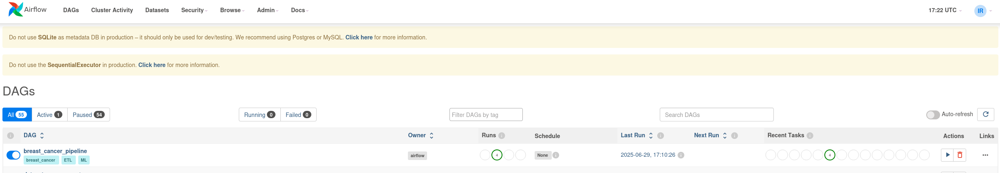
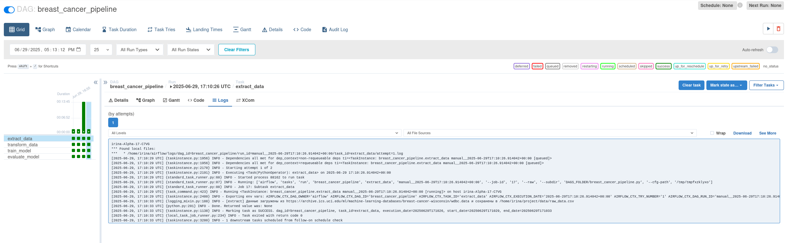
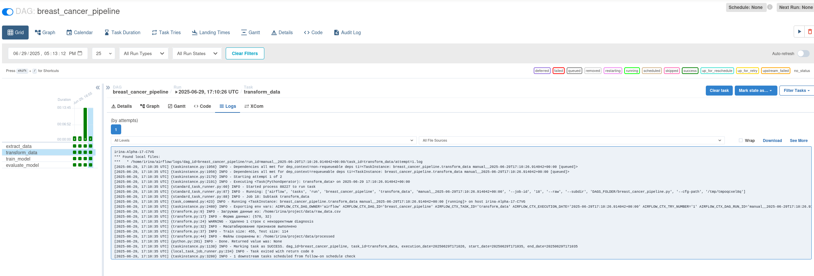
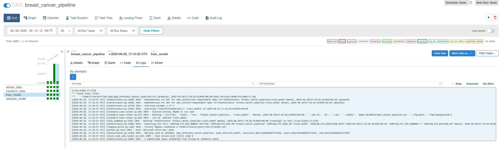
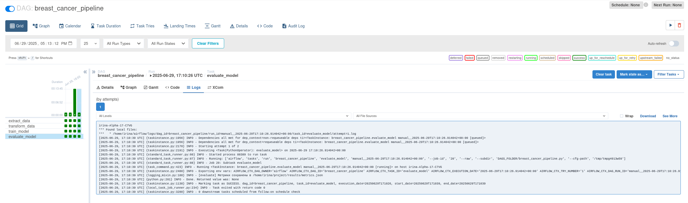

# Breast Cancer Classification ETL Pipeline

## Описание проекта

Данный проект реализует ETL-пайплайн на основе Apache Airflow для автоматической загрузки, предобработки и машинного обучения модели классификации рака молочной железы на основе Breast Cancer Wisconsin Diagnostic Dataset. Все этапы реализованы как отдельные задачи в DAG Airflow и записывают логи выполнения.

## Формулировка ML-задачи

Цель данного проекта — построить модель машинного обучения для **бинарной классификации** опухолей молочной железы на основе клинико-лабораторных признаков. Классификатор определяет, является ли опухоль **злокачественной (malignant)** или **доброкачественной (benign)**.

Тип задачи: **бинарная классификация**

Целевая переменная: `diagnosis` (`M` — злокачественная, `B` — доброкачественная)

Метрики качества: Accuracy, Precision, Recall, F1-score, ROC-AUC

---
## Архитектура и структура

Архитектура пайплайна основана на DAG из четырех задач:

1. **extract_data** — загрузка исходных данных из открытого источника;
2. **transform_data** — преобразование данных и разбиение на train/test;
3. **train_model** — обучение модели `LogisticRegression`;
4. **evaluate_model** — расчет метрик и сохранение результата.

Все шаги связаны в DAG-файл `dags/breast_cancer_pipeline.py` и выполняются автоматически с помощью Apache Airflow.

---

## Краткое описание шагов пайплайна

| Шаг               | Описание |
|------------------|----------|
| extract_data      | Скачивает CSV-файл из UCI ML репозитория |
| transform_data    | Присваивает имена колонкам, преобразует целевую переменную, масштабирует признаки, делит данные на обучающую и тестовую выборку |
| train_model       | Обучает `LogisticRegression`, сохраняет модель в `model.pkl` |
| evaluate_model    | Считает метрики и сохраняет в `metrics.json` |

---

## Последовательность задач в Airflow

Файл DAG: `dags/breast_cancer_pipeline.py`

```python
with DAG('breast_cancer_pipeline') as dag:
    extract >> transform >> train >> evaluate >> upload
```

## Архитектура пайплайна

- **Airflow DAG** с 4 шагами: extract → transform → train → evaluate 
- Каждый шаг реализован как отдельный Python-скрипт в `etl/`
- Результаты сохраняются локально в `results/`


## Структура репозитория

```
pproject/
├── dags/
│   └── breast_cancer_pipeline.py
├── etl/
│   ├── extract.py
│   ├── transform.py
│   ├── train.py
│   └── evaluate.py
├── data/
│   └── raw_data.csv, processed/
├── results/
│   └── model.pkl, metrics.json
├── logs/
│   └── *.png
└── README.md
```
```

---

## Как запустить

1. Настройте окружение с Apache Airflow.
2. Поместите DAG-файл в папку `dags/`.
3. Запустите DAG вручную или по расписанию:

```bash
airflow dags trigger breast_cancer_pipeline
```

Пример тестового запуска одной задачи:

```bash
airflow tasks test breast_cancer_pipeline extract_data 2024-01-01
```

---

## Интеграция с хранилищем

В данном проекте используется **локальное хранилище**: все результаты работы пайплайна сохраняются в папку `results/`.

### Структура хранения

- `results/model.pkl` — сохранённая модель (LogisticRegression), используется для применения к новым данным.
- `results/metrics.json` — метрики модели в JSON-формате.


### Логика использования

- Файлы формируются автоматически после выполнения DAG в Airflow.
- Их можно использовать для загрузки модели или визуализации качества.

---

## Обоснование архитектурных решений

- Используется модульность: каждый шаг реализован в своем скрипте (`etl/*.py`);
- Airflow позволяет отслеживать и управлять зависимостями;
- Сырые и обработанные данные хранятся в отдельных папках;
- Стандартизованные пути и логгирование позволяют масштабировать проект.

## Анализ ошибок и устойчивости (Robustness)

Пайплайн построен с учётом изоляции шагов, логирования и обработки возможных сбоев. Ниже приведён анализ потенциальных точек отказа и реализованных мер устойчивости.

## Устойчивость и обработка ошибок

- Пропущенные или некорректные метки классов обрабатываются через `.dropna()`;
- Логирование (`logging.info`) используется на каждом этапе;
- Все задачи поддерживают повторную попытку (`retries=1`);
- Статусы задач легко отслеживаются через UI.

## Возможности для развития

- Добавление других моделей (`RandomForest`, `XGBoost`);
- Хранение артефактов и логов в облаке;
- CI/CD деплой пайплайнов;
- Интеграция с MLflow для отслеживания экспериментов;
- Telegram-бот или Slack-оповещения о статусе выполнения.

## Скриншоты

### Список DAGов


### extract_data (успешно)


### transform_data (успешно)


### train_model (успешно)


### evaluate_model (успешно)


## Автор

Irina Romanova, 2025
---
